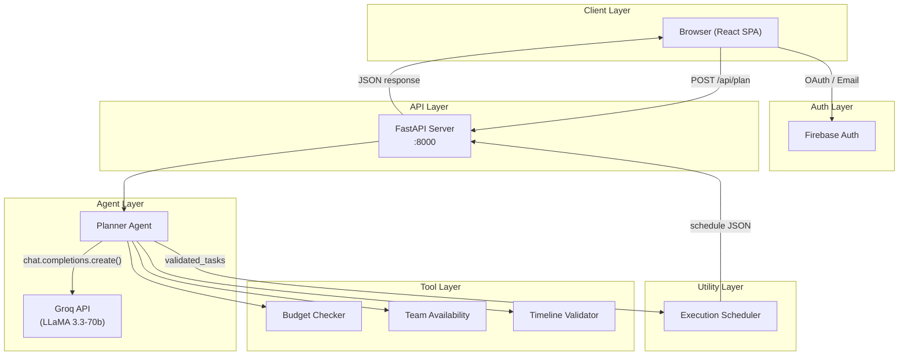
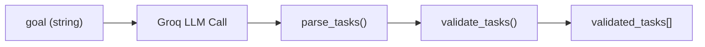
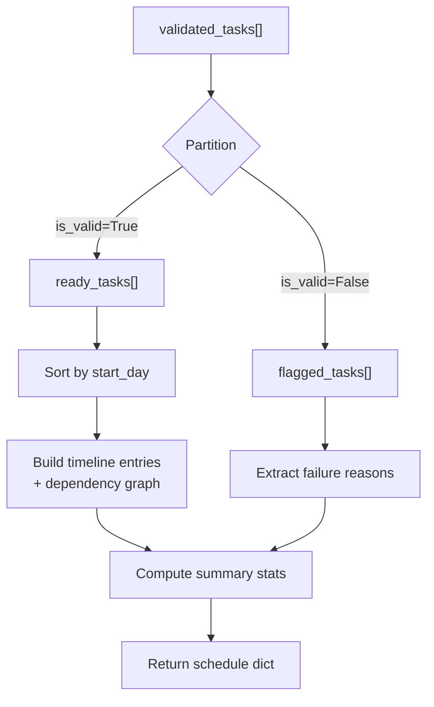
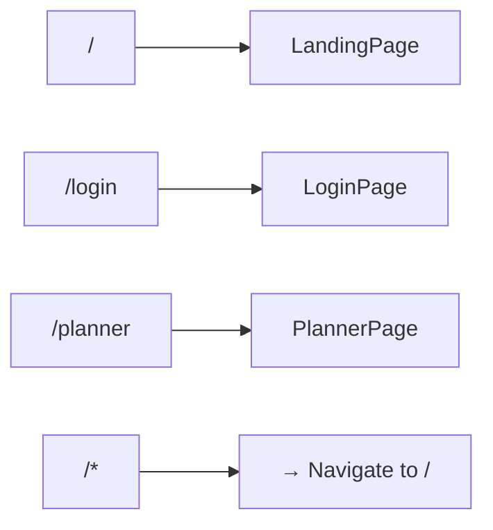
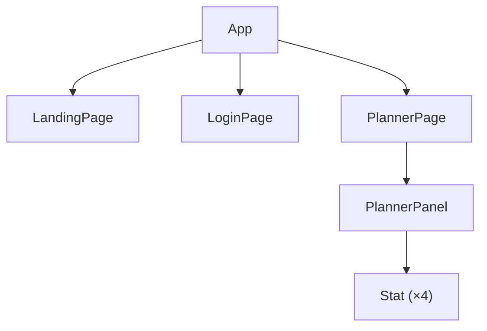
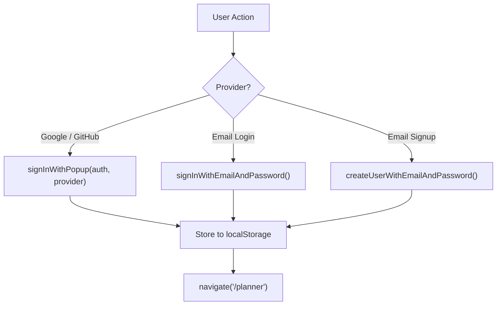
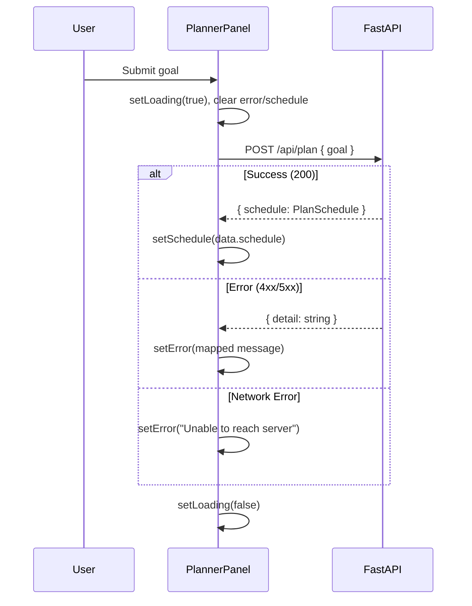
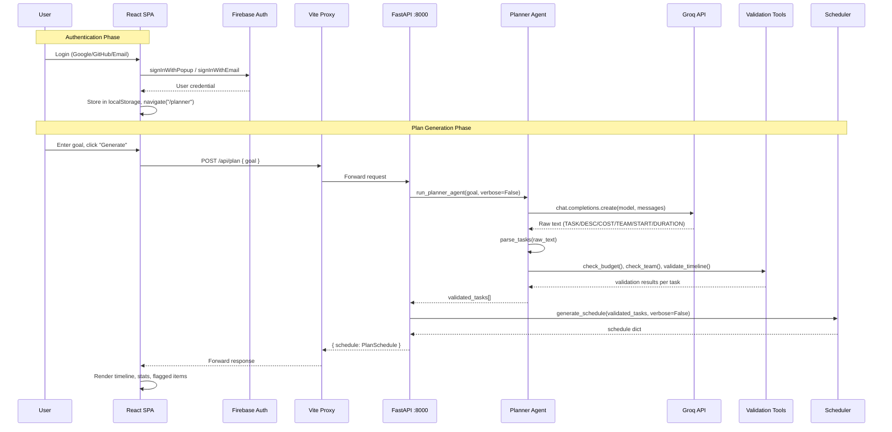
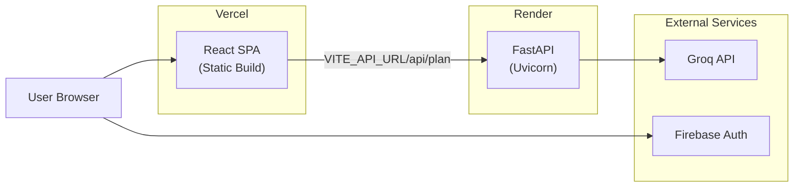
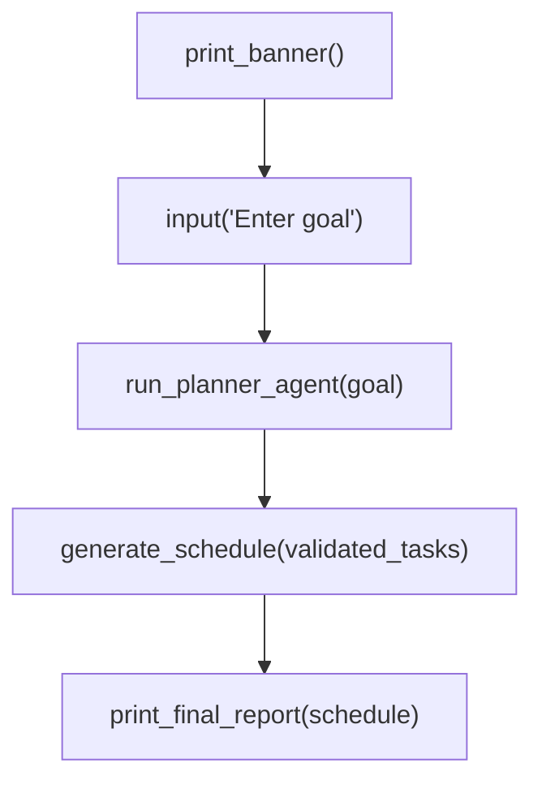

# Low-Level Design — Marketing Planner Agent

---

## 1. System Overview

The Marketing Planner Agent is a full-stack application that accepts a natural-language marketing goal and autonomously decomposes it into validated, ordered tasks with budget estimates, team assignments, and a dependency-aware timeline.

| Attribute | Value |
|---|---|
| **Architecture Style** | Client–Server, RESTful JSON API |
| **Backend Runtime** | Python 3.11 (FastAPI + Uvicorn) |
| **Frontend Runtime** | React 18 SPA (Vite + TypeScript + TailwindCSS) |
| **LLM Provider** | Groq API (LLaMA 3.3-70b-versatile) |
| **Authentication** | Firebase Auth (Google, GitHub, Email/Password) |
| **Deployment** | Vercel (frontend) · Render (backend) |

---

## 2. Architecture Diagram



---

## 3. Directory Structure & Module Map

```
marketing_planner/
│
├── .env                          # GROQ_API_KEY (backend)
├── main.py                       # CLI entry point
├── requirements.txt              # Python deps
│
├── api/
│   ├── __init__.py
│   └── app.py                    # FastAPI app, CORS, endpoints, static serve
│
├── agents/
│   └── planner_agent.py          # LLM call → parse → validate pipeline
│
├── tools/
│   ├── budget_checker.py         # Mock budget validation
│   ├── team_availability.py      # Mock team schedule lookup
│   └── timeline_validator.py     # Mock timeline/conflict check
│
├── utils/
│   └── scheduler.py              # Sorts, orders, builds dependency graph
│
└── web/                          # React SPA root
    ├── index.html                # HTML shell
    ├── vite.config.ts            # Dev proxy /api → :8000
    ├── tailwind.config.js        # Design tokens
    ├── package.json              # Frontend deps
    └── src/
        ├── main.tsx              # ReactDOM.createRoot + BrowserRouter
        ├── App.tsx               # Route definitions, Landing, Planner pages
        ├── firebase.ts           # Firebase init + providers
        ├── types.ts              # TS interfaces for API shapes
        ├── index.css             # Tailwind directives + glass design system
        └── components/
            ├── LoginPage.tsx     # Auth UI (Google, GitHub, Email)
            └── PlannerPanel.tsx  # Goal input + results display
```

---

## 4. Backend — Module-Level Design

### 4.1 API Server — [app.py](file:///c:/Users/ayush/marketing_planner/api/app.py)

| Concern | Detail |
|---|---|
| Framework | FastAPI 0.x |
| Server | Uvicorn (ASGI) |
| Port | 8000 (default) |

#### Endpoints

| Method | Path | Purpose | Request Body | Response |
|---|---|---|---|---|
| `GET` | `/api/health` | Liveness + config check | — | `{ ok: bool, has_groq_key: bool }` |
| `POST` | `/api/plan` | Generate execution plan | `{ goal: string }` | `{ schedule: PlanSchedule }` |
| `GET` | `/` | Serve frontend build (production) | — | `index.html` |
| `GET` | `/favicon.svg` | Static asset | — | SVG file |

#### CORS Configuration

```python
allow_origins = [
    "http://localhost:5173",      # Vite dev
    "http://127.0.0.1:5173",
    "http://localhost:3000",
    "http://127.0.0.1:3000",
    "https://marketing-planner-agent.vercel.app",  # Production
]
allow_credentials = True
allow_methods     = ["*"]
allow_headers     = ["*"]
```

#### Request Validation

```python
class PlanRequest(BaseModel):
    goal: str = Field(..., min_length=1, max_length=4000)
```

Pydantic automatically rejects empty or oversized payloads with a `422 Unprocessable Entity`.

#### Error Handling

| HTTP Code | Condition |
|---|---|
| 422 | Pydantic validation failure (empty/long goal) |
| 503 | `GROQ_API_KEY` not set |
| 500 | Any unhandled exception from agent/scheduler |

#### Static File Serving (Production)

When `web/dist/` exists, the server mounts `/assets` as a static directory and serves `index.html` on `/`. This enables a single-origin deployment where both API and frontend are served from the same host.

---

### 4.2 Planner Agent — [planner_agent.py](file:///c:/Users/ayush/marketing_planner/agents/planner_agent.py)

The core intelligence module. Orchestrates three phases: **LLM decomposition → Parsing → Validation**.

#### Function: `run_planner_agent(goal: str, verbose: bool = True) → list[dict]`



**Phase 1 — LLM Call**

| Parameter | Value |
|---|---|
| Model | `llama-3.3-70b-versatile` |
| System Prompt | Structured format instructions (TASK / DESC / COST / TEAM / START / DURATION) |
| User Message | `"Break down this marketing goal into subtasks: {goal}"` |
| Client | `groq.Groq(api_key=...)` |

**Phase 2 — Parsing**

#### Function: `parse_tasks(response_text: str) → list[dict]`

Parses the line-delimited LLM output into structured task dictionaries using prefix matching:

```
TASK: <task_name>        → task["task_name"]
DESC: <description>      → task["description"]
COST: <number>           → task["estimated_cost"]  (float, default 0.0)
TEAM: <m1>, <m2>         → task["team_members"]    (list[str])
START: <day>             → task["start_day"]        (int, default 1)
DURATION: <days>         → task["duration_days"]    (int, default 1)
---                      → separator (next task)
```

> [!NOTE]
> The parser tracks a `current_task` dict and appends it when a new `TASK:` line is found or at end-of-input. This handles both delimiter-separated and non-delimited output from the LLM.

**Phase 3 — Validation**

#### Function: `validate_tasks(tasks: list, verbose: bool = True) → list[dict]`

Runs each parsed task through all three tool functions and aggregates results:

```python
# Return schema per task
{
    "task"            : dict,          # original parsed task
    "budget_result"   : dict,          # from check_budget()
    "team_result"     : dict,          # from check_team_availability()
    "timeline_result" : dict,          # from validate_timeline()
    "is_valid"        : bool,          # all 3 passed
    "overall_status"  : str            # "✅ Ready" | "⚠️ Needs Attention"
}
```

Validity condition:
```python
is_valid = (
    budget_result["status"]   == "approved" and
    team_result["all_available"]            and
    timeline_result["status"] == "valid"
)
```

---

### 4.3 Validation Tools (Mock)

All three tools are stateless, pure functions with hardcoded mock data. They are designed to be swapped out for real API integrations.

---

#### 4.3.1 Budget Checker — [budget_checker.py](file:///c:/Users/ayush/marketing_planner/tools/budget_checker.py)

```python
def check_budget(task_name: str, estimated_cost: float) → dict
```

**Logic:**
1. Normalize `task_name` → `snake_case` key
2. Lookup in `available_budgets` dict (default: `$1000`)
3. If `estimated_cost <= available` → `"approved"`, else → `"rejected"`

**Mock Budget Table:**

| Task Key | Budget ($) |
|---|---|
| `competitor_ad_research` | 1,000 |
| `ad_creative_analysis` | 600 |
| `ad_targeting_analysis` | 500 |
| `ad_performance_analysis` | 700 |
| `competitor_ad_insights_report` | 1,200 |
| `competitor_ad_strategy_development` | 1,500 |
| `ad_creative_brief_development` | 900 |
| `social_media_campaign` | 800 |
| `email_marketing` | 200 |
| `seo_optimization` | 400 |
| `default` | 1,000 |

**Return Schema:**
```python
{
    "task"           : str,
    "estimated_cost" : float,
    "available"      : float,
    "status"         : "approved" | "rejected",
    "message"        : str
}
```

---

#### 4.3.2 Team Availability Checker — [team_availability.py](file:///c:/Users/ayush/marketing_planner/tools/team_availability.py)

```python
def check_team_availability(task_name: str, required_members: list) → dict
```

**Logic:**
1. For each member in `required_members`, normalize to `snake_case`
2. Lookup in `team_schedule` dict
3. Check `available` flag → `"available"`, `"busy"`, or `"not_found"`
4. Set `all_available = True` only if every member is available

**Available Roles (all currently set to available=True):**

| Role Key | Status |
|---|---|
| `content_writer` | ✅ Available |
| `seo_specialist` | ✅ Available |
| `social_media_mgr` | ✅ Available |
| `graphic_designer` | ✅ Available |
| `data_analyst` | ✅ Available |
| `email_marketer` | ✅ Available |
| `campaign_manager` | ✅ Available |

**Return Schema:**
```python
{
    "task"          : str,
    "team_results"  : dict[str, { "status": str, "message": str }],
    "all_available" : bool,
    "summary"       : str
}
```

---

#### 4.3.3 Timeline Validator — [timeline_validator.py](file:///c:/Users/ayush/marketing_planner/tools/timeline_validator.py)

```python
def validate_timeline(task_name: str, start_day: int, duration_days: int) → dict
```

**Logic:**
1. Calculate `task_end_day = start_day + duration_days`
2. **Boundary check**: `start_day >= 1` and `task_end_day <= 30`
3. **Conflict check**: Iterate `scheduled_tasks` dict for overlaps

**Project Constraints:**

| Constraint | Value |
|---|---|
| `PROJECT_START_DAY` | 1 |
| `PROJECT_END_DAY` | 30 |
| `scheduled_tasks` | `{}` (empty — no conflicts) |

**Return Schema:**
```python
{
    "task"      : str,
    "status"    : "valid" | "invalid" | "conflict",
    "start_day" : int,     # (only when valid/conflict)
    "end_day"   : int,     # (only when valid/conflict)
    "message"   : str
}
```

> [!IMPORTANT]
> The `scheduled_tasks` dict is always empty in the current mock. This means timeline conflicts will **never** be triggered. Only boundary violations (start < 1 or end > 30) can cause failure.

---

### 4.4 Execution Scheduler — [scheduler.py](file:///c:/Users/ayush/marketing_planner/utils/scheduler.py)

```python
def generate_schedule(validated_tasks: list, verbose: bool = True) → dict
```

#### Algorithm



**Dependency Detection:**
```python
# For each task, if a previous task's end_day <= current start_day,
# it is marked as a dependency
for prev in schedule["timeline"]:
    if prev["end_day"] <= start_day:
        entry["depends_on"].append(prev["task_name"])
```

> [!NOTE]
> This is a simplified "start-after-finish" heuristic, not a full DAG solver. All preceding tasks that finish before the current start are listed as dependencies.

**Flagged Task Reason Extraction:**
```python
reasons = []
if budget_result["status"] != "approved":     reasons.append("Budget insufficient")
if not team_result["all_available"]:          reasons.append("Team unavailable")
if timeline_result["status"] != "valid":      reasons.append("Timeline conflict")
```

**Return Schema — `PlanSchedule`:**
```python
{
    "generated_at"  : str,              # "YYYY-MM-DD HH:MM:SS"
    "total_tasks"   : int,
    "ready_count"   : int,
    "flagged_count" : int,
    "timeline"      : [                 # sorted by start_day
        {
            "order"          : int,
            "task_name"      : str,
            "description"    : str,
            "start_day"      : int,
            "end_day"        : int,
            "duration_days"  : int,
            "team_members"   : list[str],
            "estimated_cost" : float,
            "depends_on"     : list[str]
        }
    ],
    "flagged"       : [
        {
            "task_name" : str,
            "reasons"   : list[str]
        }
    ],
    "summary"       : {
        "total_budget"     : float,
        "team_involved"    : list[str],
        "project_duration" : int,         # max end_day
        "completion_rate"  : str          # "X/Y tasks ready"
    }
}
```

---

## 5. Frontend — Module-Level Design

### 5.1 Technology Stack

| Library | Version | Purpose |
|---|---|---|
| React | 18.3.x | UI framework |
| TypeScript | 5.6.x | Type safety |
| Vite | 5.4.x | Bundler + dev server |
| TailwindCSS | 3.4.x | Utility-first CSS |
| React Router DOM | 7.14.x | Client-side routing |
| Firebase | 12.11.x | Authentication |
| Lucide React | 0.468.x | Icon library |
| Motion | 12.38.x | Animation library |
| clsx | 2.1.x | Conditional classnames |

---

### 5.2 Application Entry & Routing

#### [main.tsx](file:///c:/Users/ayush/marketing_planner/web/src/main.tsx)

```
ReactDOM.createRoot → StrictMode → BrowserRouter → App
```

#### [App.tsx](file:///c:/Users/ayush/marketing_planner/web/src/App.tsx) — Route Definitions



| Route | Component | Auth Required | Description |
|---|---|---|---|
| `/` | `LandingPage` | No | Marketing landing page |
| `/login` | `LoginPage` | No | Auth (login/signup) |
| `/planner` | `PlannerPage` | Yes | Protected planner UI |
| `/*` | `Navigate` | — | Catch-all → redirect to `/` |

#### Theme Management

```typescript
// State: "dark" | "light" (default: "dark")
// Persisted to: localStorage("theme")
// Applied via: document.documentElement.classList.toggle("dark")
```

Theme state is lifted to `App` and passed as props to all page components via `{ theme, toggleTheme }`.

---

### 5.3 Component Tree



---

### 5.4 LoginPage — [LoginPage.tsx](file:///c:/Users/ayush/marketing_planner/web/src/components/LoginPage.tsx)

**Props:** `{ theme: "dark" | "light", toggleTheme: () => void }`

#### State

| State Variable | Type | Purpose |
|---|---|---|
| `mode` | `"login" \| "signup"` | Toggle between forms |
| `email` | `string` | Email input |
| `password` | `string` | Password input |
| `confirmPassword` | `string` | Signup only |
| `showPassword` | `boolean` | Eye toggle |
| `loading` | `boolean` | Email form submit |
| `googleLoading` | `boolean` | Google OAuth in progress |
| `githubLoading` | `boolean` | GitHub OAuth in progress |
| `error` | `string \| null` | Error banner |
| `success` | `string \| null` | Success banner |

#### Authentication Flows



**localStorage keys set on successful auth:**

| Key | Value |
|---|---|
| `auth_user` | `user.email \|\| user.displayName \|\| "user"` |
| `auth_photo` | `user.photoURL \|\| ""` |
| `auth_name` | `user.displayName \|\| ""` |

#### Firebase Error Mapping

```typescript
function getFirebaseError(code: string): string
```

| Firebase Code | User Message |
|---|---|
| `auth/email-already-in-use` | An account with this email already exists. |
| `auth/invalid-email` | Please enter a valid email address. |
| `auth/weak-password` | Password must be at least 6 characters. |
| `auth/user-not-found` | No account found with this email. |
| `auth/wrong-password` | Incorrect password. Please try again. |
| `auth/invalid-credential` | Incorrect email or password. |
| `auth/popup-closed-by-user` | Sign in was cancelled. |
| `auth/account-exists-with-different-credential` | An account already exists with this email using a different sign-in method. |
| (default) | Something went wrong. Please try again. |

---

### 5.5 PlannerPage (inline in App.tsx)

**Route Guard:**
```typescript
const user = localStorage.getItem("auth_user");
if (!user) return <Navigate to="/login" replace />;
```

**Logout:**
```typescript
localStorage.removeItem("auth_user");
navigate("/");
```

Renders the `<PlannerPanel />` component.

---

### 5.6 PlannerPanel — [PlannerPanel.tsx](file:///c:/Users/ayush/marketing_planner/web/src/components/PlannerPanel.tsx)

The main interactive component.

#### API Configuration

```typescript
const API = import.meta.env.VITE_API_URL
  ? `${import.meta.env.VITE_API_URL}/api/plan`
  : "/api/plan";
```

- **Dev**: Proxied through Vite (`/api` → `http://127.0.0.1:8000`)
- **Prod**: Uses `VITE_API_URL` env var (points to Render backend)

#### State

| State | Type | Purpose |
|---|---|---|
| `goal` | `string` | User input |
| `loading` | `boolean` | Submit in progress |
| `error` | `string \| null` | Error message |
| `schedule` | `PlanSchedule \| null` | API Response |

#### Request Flow



#### Frontend Error Mapping

| Server Response Pattern | Displayed Message |
|---|---|
| Contains `401`, `invalid_api_key` | The Groq API key is missing or invalid. |
| Contains `503`, `GROQ_API_KEY is not set` | The backend is not configured. |
| Contains `500` | The server encountered an error. |
| Contains `429` | Too many requests. |
| Fetch error | Unable to reach the server. |
| Other | Something went wrong. |

#### Results Display

When `schedule` is non-null, renders:

1. **Summary Stats** — 4 × `<Stat>` cards (Budget, Duration, Tasks Ready, Team)
2. **Timeline** — Ordered list of `ScheduleTask` items showing name, day range, cost, team, dependencies
3. **Flagged Tasks** — Amber-highlighted list with failure reasons
4. **Timestamp** — "Generated at …"

#### Stat Sub-component

```typescript
function Stat({ icon, label, value, small? }: {
    icon: ReactNode, label: string, value: string, small?: boolean
}) → JSX.Element
```

---

### 5.7 TypeScript Data Models — [types.ts](file:///c:/Users/ayush/marketing_planner/web/src/types.ts)

```typescript
interface ScheduleTask {
    order          : number;
    task_name      : string;
    description    : string;
    start_day      : number;
    end_day        : number;
    duration_days  : number;
    team_members   : string[];
    estimated_cost : number;
    depends_on     : string[];
}

interface FlaggedTask {
    task_name : string;
    reasons   : string[];
}

interface PlanSchedule {
    generated_at   : string;
    total_tasks    : number;
    ready_count    : number;
    flagged_count  : number;
    timeline       : ScheduleTask[];
    flagged        : FlaggedTask[];
    summary        : {
        total_budget      : number;
        team_involved     : string[];
        project_duration  : number;
        completion_rate   : string;
    };
}
```

---

### 5.8 Firebase Configuration — [firebase.ts](file:///c:/Users/ayush/marketing_planner/web/src/firebase.ts)

```typescript
const firebaseConfig = {
    apiKey            : import.meta.env.VITE_FIREBASE_API_KEY,
    authDomain        : import.meta.env.VITE_FIREBASE_AUTH_DOMAIN,
    projectId         : import.meta.env.VITE_FIREBASE_PROJECT_ID,
    storageBucket     : import.meta.env.VITE_FIREBASE_STORAGE_BUCKET,
    messagingSenderId : import.meta.env.VITE_FIREBASE_MESSAGING_SENDER_ID,
    appId             : import.meta.env.VITE_FIREBASE_APP_ID,
};

export const auth           = getAuth(initializeApp(firebaseConfig));
export const googleProvider = new GoogleAuthProvider();
export const githubProvider = new GithubAuthProvider();
```

All Firebase config values are sourced from `web/.env` (VITE-prefixed).

---

## 6. End-to-End Data Flow



---

## 7. Design System — CSS Architecture

### 7.1 Glass Morphism Component Classes

The UI uses a custom glassmorphism design system defined in [index.css](file:///c:/Users/ayush/marketing_planner/web/src/index.css):

| Class | Usage | Key Properties |
|---|---|---|
| `.glass-nav` | Sticky header | `backdrop-filter: blur(20px)`, semi-transparent bg |
| `.glass-panel` | Large content containers | `blur(20px)`, border, shadow |
| `.glass-card` | Feature/stat cards | `blur(16px)`, lighter shadow |
| `.glass-card-hover` | Interactive card states | Transition on border, bg, shadow |
| `.glass-btn-ghost` | Ghost/outline buttons | `blur(12px)`, border transition |
| `.glass-icon-btn` | Icon-only buttons | `blur(12px)`, `0.75rem` radius |
| `.glass-pill` | Label badges | Sky-tinted border + bg |
| `.glass-mobile-nav` | Mobile nav drawer | `blur(20px)`, top border |

Each class has explicit `.dark` variants for the dark theme.

### 7.2 Animations

| Animation | Keyframes | Duration | Usage |
|---|---|---|---|
| `fade-in-up` | 0→14px translateY | 0.72s | Hero section staggered entry |
| `gentle-glow` | Scale 1→1.03 | 14s | Background glow pulse |
| `float` | translateY 0→-6px | 6s | Bot icon hover |
| `fade-in-soft` | Opacity 0→1 | 0.8s | Section fade-in |
| `marquee` | translateX 0→-50% | 45s | (Unused, defined in config) |

All motion is gated behind `prefers-reduced-motion: no-preference`.

### 7.3 Tailwind Extensions

Defined in [tailwind.config.js](file:///c:/Users/ayush/marketing_planner/web/tailwind.config.js):

- **Font**: Inter (Google Fonts, loaded in `index.html`)
- **Custom Colors**: CSS variable-based (`--border`, `--background`, etc.)
- **Background Image**: `hero-glow` radial gradient

---

## 8. Environment Variables

### Backend (root `.env`)

| Variable | Required | Description |
|---|---|---|
| `GROQ_API_KEY` | ✅ | Groq API key for LLM access |

### Frontend (`web/.env`)

| Variable | Required | Description |
|---|---|---|
| `VITE_FIREBASE_API_KEY` | ✅ | Firebase Web API key |
| `VITE_FIREBASE_AUTH_DOMAIN` | ✅ | Firebase auth domain |
| `VITE_FIREBASE_PROJECT_ID` | ✅ | Firebase project ID |
| `VITE_FIREBASE_STORAGE_BUCKET` | ✅ | Firebase storage bucket |
| `VITE_FIREBASE_MESSAGING_SENDER_ID` | ✅ | Firebase messaging sender ID |
| `VITE_FIREBASE_APP_ID` | ✅ | Firebase app ID |
| `VITE_API_URL` | Prod only | Backend base URL (e.g., Render) |

---

## 9. Deployment Topology



| Component | Platform | Build Command | Start Command |
|---|---|---|---|
| Frontend | Vercel | `npm run build` | — (static) |
| Backend | Render | `pip install -r requirements.txt` | `uvicorn api.app:app --host 0.0.0.0 --port $PORT` |

---

## 10. Security Considerations

| Area | Current Implementation | Production Recommendation |
|---|---|---|
| **API Auth** | None (public endpoint) | Add JWT/API-key validation middleware |
| **CORS** | Allowlisted origins | Keep restrictive; remove localhost in prod |
| **Secrets** | `.env` files, gitignored | Use platform-level secret management |
| **Input Validation** | Pydantic `max_length=4000` | Add rate limiting, sanitization |
| **Auth State** | `localStorage` (client-only check) | Verify Firebase ID token server-side |
| **LLM Output** | Rendered as text | Sanitize before display to prevent XSS |
| **HTTPS** | Enforced by Vercel/Render | Ensure no mixed content |

> [!WARNING]
> The route guard on `/planner` is purely client-side. The API endpoint `/api/plan` is publicly accessible without authentication. In production, the backend should validate Firebase ID tokens via middleware before processing requests.

---

## 11. CLI Entry Point — [main.py](file:///c:/Users/ayush/marketing_planner/main.py)

Alternative entry point for terminal usage without the web UI.



Outputs a formatted report with:
- Total tasks, scheduled vs flagged counts
- Per-task timeline (day range, cost, team, dependencies)
- Flagged items with failure reasons

---

## 12. Known Limitations & Future Improvements

| # | Limitation | Potential Improvement |
|---|---|---|
| 1 | All validation tools use hardcoded mock data | Connect to real finance, HR, and PM APIs |
| 2 | `scheduled_tasks` dict in timeline validator is always empty | Maintain state across invocations |
| 3 | Dependency detection is approximation (all-preceding heuristic) | Implement proper DAG-based topological sort |
| 4 | LLM output parsing is brittle (line-prefix matching) | Use structured output (JSON mode) from LLM |
| 5 | No persistent user data storage | Add database (PostgreSQL/Firestore) for plans |
| 6 | No backend authentication | Add Firebase ID token verification middleware |
| 7 | Single LLM model hardcoded | Make model configurable via env/UI |
| 8 | No retry logic for LLM API calls | Add exponential backoff with circuit breaker |
| 9 | No plan history or export | Add save/load and PDF/CSV export |
| 10 | No unit or integration tests | Add pytest (backend) and Vitest (frontend) |
